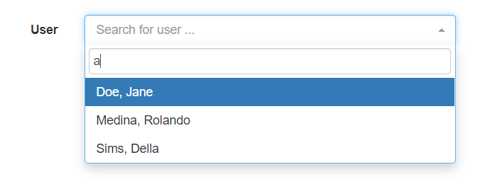
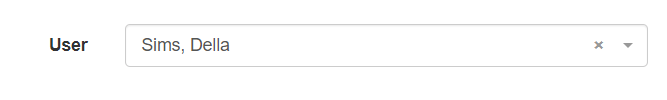
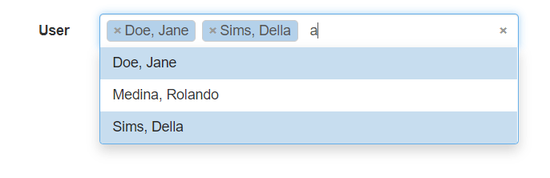
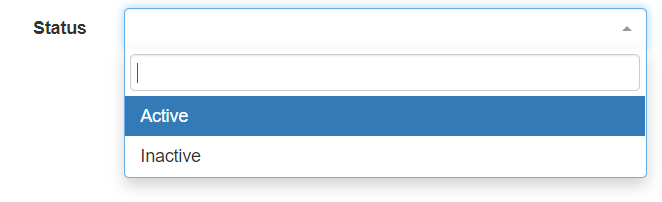

## Introduction

This is a [Symfony](https://symfony.com/) Bundle that provides an autocomplete Form Type. This was designed for 
Symfony v4+.
Currently, this widget uses [Select2](https://select2.org/) as its base. In the future I might add other 'autocomplete'
widgets using different interfaces.

This is a replacement for my older [Typeahead](https://github.com/lifo101/typeahead-bundle) Bundle that was
originally for Symfony v2 and hasn't been updated in years (but has served me well!). This is not a one-for-one
replacement, but rather a more modern approach to doing things. 

**_I'm still working on features and ironing out some small issues._ I have not tagged any releases yet.**

### Features

* Supports Entity and Non-Entity lookups using a single class type.
* Supports AJAX or Array lists.
* Easily add the javascript code to your existing bundler _(webpack, etc)_, or use it directly via a `<script>` tag.
* Support different themes like `bootstrap`.
* Supports `tagging` - The ability of adding new entities or items.
* Form types for `Select` and `Vue-Multiselect` widgets. Vue-Multiselect type is not documented yet.

### Requirements

* This bundle requires the [Select2](https://select2.org/) or [Vue-multiselect](https://vue-multiselect.js.org/)
javascript and CSS code, but does not provide it directly. You must include it yourself, 
eg: `yarn add select2`, and add it to your webpack or other bundler configuration.

* `Select2` requires [jQuery](https://jquery.com/) and is not actually provided in this bundle. 
You must provide it yourself, eg: `yarn add jquery`

### Examples

_Note: The examples below use the `bootstrap` theme from the NPM package `select2-bootstrap-theme` (`yarn add select2-bootstrap-theme`)._

A simple select box that allows a single entity `User` to be selected from an AJAX request.




```php
use Lifo\AutocompleteBundle\Form\Type\Select2Type;

$builder->add('user', Select2Type::class, [
    'route'            => 'users_lookup',
    //'url'              => '/absolute/url/instead/of/route',
    'min_input_length' => 1,
    'placeholder'      => 'Search for user ...',
]);
```

A simple select box that allows a multiple `User` entities to be selected from an AJAX request.



```php
$builder->add('users', Select2Type::class, [
    'route'            => 'users_lookup',
    'min_input_length' => 1,
    'multiple'         => true,
    'placeholder'      => 'Search for user ...',
]);
```

A simple select box that uses a plain array of choices.



```php
$builder->add('status', Select2Type::class, [
    'help_block' => 'Inactive users cannot login.',
    'choices'    => [
        'Active'   => 1,
        'Inactive' => 0,
    ],
]);
```

## Configuration

There are a lot of options to customize the way the autocomplete widget functions. Defaults are shown.
Note: A `route`, `url`, or `choices` must be specified for the widget to function.

Option|Default|Description
:-:|:-:|---
**route**                 | `null`        | Symfony route name to generate an URL to perform an AJAX search request.
**route_params**          | `null`        | Parameter array to generate the `route`
**url**                   | `null`        | An absolute URL to perform the AJAX search request from instead of a `route` name.
**choices**               | `null`        | An keyed array of choices to populate the select box with instead of using AJAX.
**class**                 | `null`        | The Entity class representing the items in the results. Can be `null` to use non-entities.
**property**              | `"id"`        | The unique ID property name to use for the `id` of each item.
**text_property**         | `null`        | The property to render the selection text from. Can be `null` if your Entity has a `__toString` method.
**multiple**              | `false`       | If true, multiple items can be selected.
**min_input_length**      | `0`           | Minimum input length required before a search request is performed.
**max_selections**        | `0`           | Maximum selections allowed (`multiple` is true). Set to `0` for no limit.
**delay**                 | `250`         | Delay, in milliseconds before a search request is performed.
**tags**                  | `false`       | Enable `tagging` support (adding new entries).
**placeholder**           | `null`        | Placeholder text shown in the widget when nothing is selected.
**allow_clear**           | `true`        | Allow the selection(s) to be cleared with a single click of an "x" icon.
**close_on_select**       | `true`        | Close the dropdown after a selection is made.
**theme**                 | `"bootstrap"` | Theme to use. 'default' is the standard option for Select2.
**language**              | `"en"`        | Lanuage to use.
**dropdown_auto_width**   | `false`       | If true, the dropdown width will expand to its contents.
**dropdown_parent**       | `null`        | CSS Selector target for the dropdown parent placement. Useful if you need to target a modal, etc.
**dir**                   | `"ltr"`       | Language direction: Left-to-Right (rtl), or Right-to-Left (ltr)
**disabled**              | `false`       | If true, the select will be disabled.
**transformer**           | `null`        | Custom `DataTransformer` to use.

## Installation

### Symfony v4+, v5+, v6+

`composer require lifo/autocomplete-bundle`

If you're using [Flex](https://symfony.com/doc/current/setup/flex.html) then the bundle will work w/o any other 
configuration.

If you're not using `Flex` then you'll need to register the bundle in `bundles.php`:

```php
// config/bundles.php
return [
    // ...
    Lifo\AutocompleteBundle\LifoAutocompleteBundle::class => ['all' => true],
    // ...
];
```

### Twig Configuration

By default, the form theme is enabled automatically in Twig, but you can disable this if you need to with the following config:

```yaml
lifo_autocomplete:
  autoconfigure: false
```

If `autoconfigure` is disabled, you'll have to manually update your Twig config: 

```yaml
    # config/packages/twig.yaml
    form_themes:
        - '@LifoAutocomplete/autocomplete.html.twig'
```


### Symfony v3.x

Symfony v3 is not officially supported, but might work if you manually register the
bundle in `app/AppKernel.php`

```php
$bundles = array(
  // ...
  new Lifo\AutocompleteBundle\LifoAutocompleteBundle(),
);
```

### Webpack

This is an example of how to add the javascript and CSS to your app. The concept here is similar to other
bundlers as well.

In your main entry point you would add something similar as this:

```javascript
// assets/app.js
import 'bootstrap'
import 'select2'
require('select2/dist/css/select2.min.css');
// ...
```

### Script Tag

You can include the required javascript by using straight script tags too. The paths here assume the files
are already in your `public` web directory.

```html
<script src="js/select2/dist/js/select2.js"></script>

<link href="css/select2.min.css" type="text/css" rel="stylesheet" />
```

## Data Format

AJAX responses and the simple Array lists require the following format:

```php
[ 
  'results' => [ 
    [
      'id'   => 'unique ID',
      'text' => 'text displayed',
    ],
    [
      'id'   => 'unique ID',
      'text' => 'text displayed',
    ],
  ],
  'more' => true|false,
  // or:
  // 'pagination' => [
  //   'more' => true|false
  // ]
```

## AJAX Requests

`Select2` sends the following on [AJAX requests](https://select2.org/data-sources/ajax#request-parameters).

* **`term`** - The current search term in the search box.
* **`q`** - Contains the same contents as `term`.
* **`_type`** - "request type". Will usually be query, but changes to query_append for paginated requests.
* **`page`** - The current page number to request. Only sent for paginated (infinite scrolling) searches.
